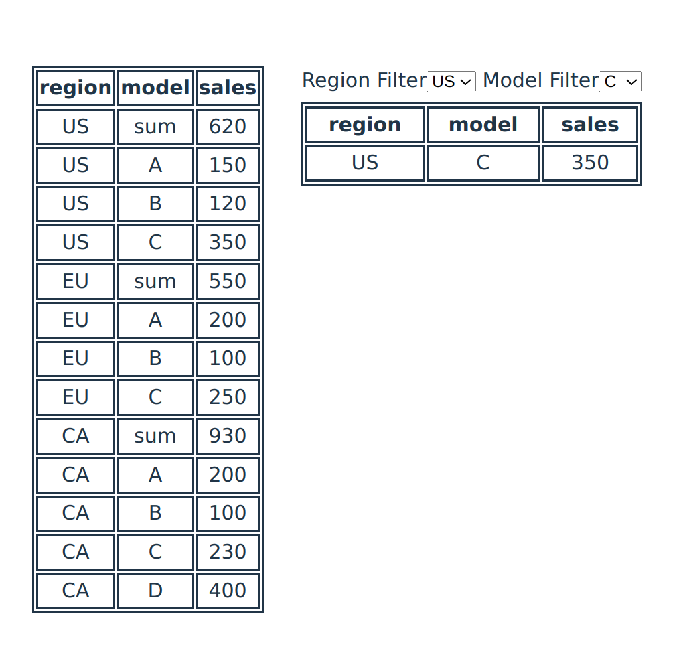

## Sales Data Table

<p align="center">
   
</p>

### Getting Started

```
npm install
npm run dev
```

## React Interview Questions

1. How do you decide when to split a component into subcomponents?
   > A component needs to be split into subcomponents when the logic that is encapsulated in that component grows to become more than just managing a single point of responsibility (i.e. can be broken into more modular parts for clarity and maintainability) in the application or if I see a piece of code that will become something that will be constantly reused, then that is a good candidate for something to be refactored out into its own component. These are two common reasons that I come across that leads me to break up a component into subcomponents.
2. What is the difference between state and props?
   > Props is an object that contains all the user-defined data that is passed into a component. State in React are pieces of data that you can define to be linked to specific components (defined inside of them with the `useState` hook) that persist across re-renders of that component. Both props and state changes will trigger re-renders of said component. Props can be thought of as input into a component while state can be thought of as a component's internal set of variables that you want to associate with and use within that component.
3. How to trigger rerender in a component?
   > Three things will trigger a component re-render:
   >
   > 1. The parent or an ancestor component re-renders, causing all children components to re-render.
   > 2. The input props object changes, causing the component to re-render.
   > 3. An/any internal state variables of the component changes, causing a re-render.
4. Why do you like react over other front-end libraries and frameworks?
   > I like that React itself is just a library for building UI. It allows me to have the freedom to choose the libraries I know best for other functionality I need to build like using React Router for page rounting and Reduce for global state manageemnt or Tanstack/React Query for asynchronous state management and data fetching. React can be used with regular Javascript or Typescript, giving teams the option to go with the route that best suites them. Personally, I prefer having type checking at compile time and would opt into using Typescript for all my React projects. A popular comparison to be done is compare React with Angular, two of the most popular "frameworks" used to build web apps. There are many differences between the two, but for me personally I prefer building with React because it uses one-way data binding compared to Angular's two-way data binding which to me is easier to reason about and React uses component-based UI that lets me write in a declarative functional programmign way that is more intuitive to me compared to Angular's MVC-component based templates.
5. What’s the difference between controlled components and uncontrolled components?
   > Controlled vs uncontrolled components is relevant in a component that manages form data. If form data is managed with React state with handled with functions that trigger with state changes, then it is called a controlled component; if it is left to the DOM to manage the data and we retrieve it with refs from the DOM then it is uncontrolled. React documentation advises that we should prefer controlled components as it allows us more control over what happens with form such as automatic input validation on form input change.
6. How to prevent components from unnecessary rerendering?
   > First, it is important to structure components into modular blocks that ideally handle one specifc thing so that when other unrelated UI have a state change it doesn't cause our component to re-render. Another thing that we can do is to use the `useMemo` hook and memoize our component to be not re-rendered if the parent component re-renders as long as the input props don't change. Note however that if an internal state of the component changes the component will still re-render, because that's what we would expect.
7. Why are props needed to be immutable?
   > Props need to be immutable because it allows React to quickly and efficiently calculate if a component needs to be re-rendered or not. If props were mutable and we mutated a property on the props, React can no longer compare the new props to the old props by reference/memory address. It would now need to recursively look inside of the props object to check all values, and that can get very slow. Therefore, it is important that props are immutable so that React can very quickly compare the new props with the old props by reference to determine if a re-render is necessary.
8. Explain the Virtual DOM and how React uses it to improve performance.
   > The Virtual DOM (VDOM) is a React-managed Javascript object in memory that represents the UI component tree of your application. It is synced with the actual DOM via a process called reconciliation. Syncing would require being able to compare DOM trees, virtual or not. Generic algorithms that compute the minimum number of changes to transform one tree to another (syncing our VDOM to the actual DOM) would take $O(n^3)$ comparisions, where $n$ is the number of nodes, which is too slow. That is why React assumes some practical conditions that the developer needs to follow that allows them to do this process in $O(n)$ using a heuristic algorithm. This is the diffing algorithm that React uses to compare the most current VDOM to the previous VDOM to see if it needs to make changes to the actual DOM. React chooses to not make changes to the actual DOM directly because manipulating and managing a VDOM is much faster than writing changes to the DOM.
9. Can you explain the useMemo and useCallback hooks and provide examples of when you might use them?
   > The `useMemo` hook allows one to cache a calculation result to be used across re-renders. The usage of it is like `const cachedValue = useMemo(calculateValue, dependencies)` where `calculateValue` is a pure function that should use the variables defined in the `dependencies` array as input that will compute the `cachedValue` result. This tells React that we don't need to recalculate the `cachedValue` across re-renders as long as the values in the `dependencies` array doesn't change. An example of using `useMemo` can be to cache a component that displays data that is inputted as props that lives inside of a component that may re-render a lot but you don't need that display component to be reconstructed if the data doesn't change and it does something computationally expensive to display the data.
   > The `useCallback` hook is used to cache a function that can be used across re-renders. The usage of it is like `const cachedFn = useCallback(fn, dependencies)`. The `fn` doesn't need to be pure and call have side effects like fetching data over the network. This is useful when you need to pass a function to a Component as as prop, and you know this function doesn't change unless whatever you pass into the `dependencies` array changes. Note that you do NOT pass the input variable of the function to be cached as a dependency, because that variable is going to be passed whenever the function is called! You only pass in variables that is used inside of the function itself that is not an input variable into the `dependencies` array.
10. Explain the concept of Higher-Order Components (HOCs) and provide an example use case.

    > HOCs is the concept of writing functions that take components, wrap them inside of another component, and returns that outer component. Think of it like function composition `h(g(f))` but with components. The idea of HOCs is for using class components and you want to re-use a component but give it different props for different use cases. You can define a HOC that, for different input like a secondary config variable argument, pass different props to a component that you pass into the function as a first argument. React documentation gives an example like this:

    ```js
    const CommentListWithSubscription = withSubscription(
      CommentList,
      (DataSource) => DataSource.getComments()
    );

    const BlogPostWithSubscription = withSubscription(
      BlogPost,
      (DataSource, props) => DataSource.getBlogPost(props.id)
    );
    ```

    where `withSubscription` is the function that creates the HOCs and we re-use the components `CommentList` and `BlogPost` as different components but with different data input as props into them that we describe with the second argument input.

11. Discuss the differences between React's class components and functional components. Which one do you prefer and why?
    > React class components give you access to lifecycle methods and makes writing components more verbose and imperative (write code that is more explicit on how to do things). Compare this to functional components that replaces lifecycles methods with hooks and lets you write code in a declarative manner (write code that is more about describing what you want to do, rather than how) that is easier to read, write, and maintain.
12. How do you ensure your code is maintainable and scalable?
    > To create UI that is maintainable and scalable I would follow modern principles like: using functional components with hooks, keeping components lean and modular by following separation of concerns, using reasonable code organization for file directory structure, organizing CSS styling outside of JSX, using unit tests, and writing good documentation / comments on things that are not obvious in the code.
